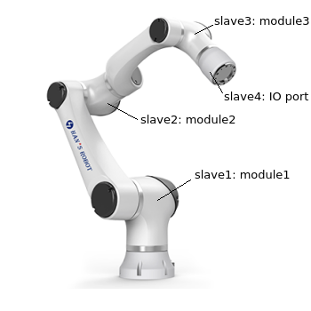

Fix ESI (EtherCAT Slave Infomation)
====

If you got an error info as follows, there are two possible reasons.
```
ERROR: slave_no(1) : channel(352) is larger than Input bits (256)
```

## Reason 1
You may have used the wrong launch file(elfin_ros_control.launch/elfin_ros_control_v2.launch) (for details: [README.md](../README.md)). If you don't know which version of Elfin you have. You can just try both of the launch files.
```sh
$ sudo chrt 10 bash
$ roslaunch elfin_robot_bringup elfin_ros_control.launch
```
or
```sh
$ sudo chrt 10 bash
$ roslaunch elfin_robot_bringup elfin_ros_control_v2.launch
```

## Reason 2
If it's not the reason 1, then the ESI on the robot may be wrong.

### How to fix ESI
Connect Elfin to the computer with a LAN cable. Then confirm the ethernet interface name of the connection with `ifconfig`. The default ethernet name is eth0. If the ethernet name is not eth0, in the next steps you should correct the following line in the file *elfin_ethercat_driver/config/write_esi.yaml*.
```
elfin_ethernet_name: eth0
```
There are 4 EtherCAT slaves on the robot. If there is no other EtherCAT device connected to the same NIC, the numbers of the 4 Elfin EtherCAT slaves are as shown below.


If there are other EtherCAT devices, then in the next steps you should correct the following lines in the file *elfin_ethercat_driver/config/write_esi.yaml* accordingly.
```
slave_no: [1, 2, 3]
```
and
```
slave_no: [4]
```

#### Elfin with the version 1 of EtherCAT slaves
* Fix module ESI  
    Please set the parameters in the file *elfin_ethercat_driver/config/write_esi.yaml* as follows.
    ```
    eth_name: eth0
    slave_no: [1, 2, 3]
    esi_file: elfin_module.esi
    ```

    Then fix ESI with following commands.
    ```sh
    $ sudo chrt 10 bash
    $ roslaunch elfin_ethercat_driver elfin_esi_write.launch
    ```
* Fix IO port ESI  
    Please set the parameters in the file *elfin_ethercat_driver/config/write_esi.yaml* as follows.
    ```
    eth_name: eth0
    slave_no: [4]
    esi_file: elfin_io_port.esi
    ```

    Then fix ESI with following commands.
    ```sh
    $ sudo chrt 10 bash
    $ roslaunch elfin_ethercat_driver elfin_esi_write.launch
    ```

    Finally, restart the robot. Now ESI should be fixed.

    Besides, some backup files of the original ESI of the slaves that are fixed are generated in elfin_ethercat_driver/script/ folder.

#### Elfin with the version 2 of EtherCAT slaves
* Fix module ESI  
    Please set the parameters in the file *elfin_ethercat_driver/config/write_esi.yaml* as follows.
    ```
    eth_name: eth0
    slave_no: [1, 2, 3]
    esi_file: elfin_module_v2.esi
    ```

    Then fix ESI with following commands.
    ```sh
    $ sudo chrt 10 bash
    $ roslaunch elfin_ethercat_driver elfin_esi_write.launch
    ```
* Fix IO port ESI  
    Please set the parameters in the file *elfin_ethercat_driver/config/write_esi.yaml* as follows.
    ```
    eth_name: eth0
    slave_no: [4]
    esi_file: elfin_io_port_v2.esi
    ```

    Then fix ESI with following commands.
    ```sh
    $ sudo chrt 10 bash
    $ roslaunch elfin_ethercat_driver elfin_esi_write.launch
    ```

    Finally, restart the robot. Now ESI should be fixed.

    Besides, some backup files of the original ESI of the slaves that are fixed are generated in elfin_ethercat_driver/script/ folder.
