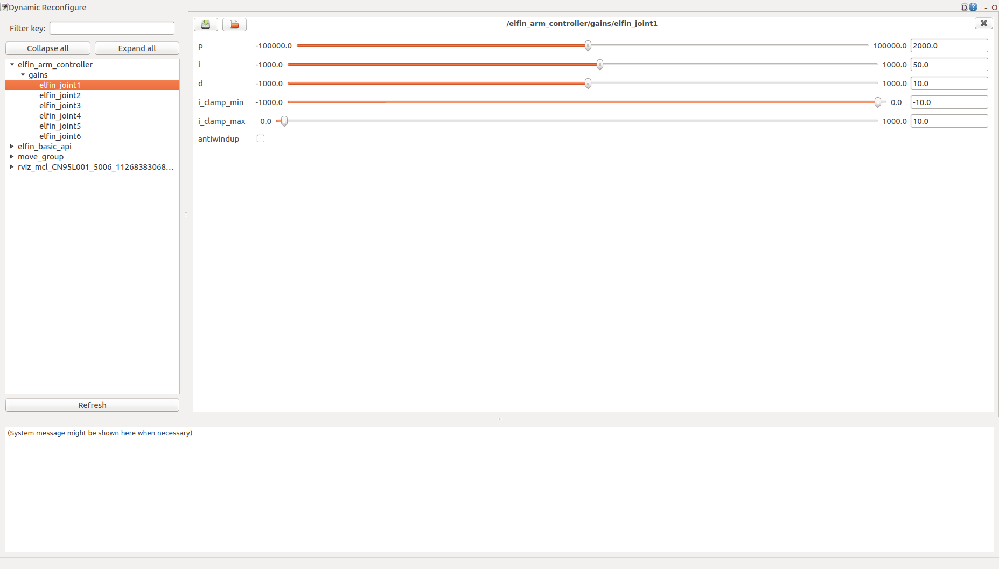

Torque mode hardware interface
====

A controller with the hardware interface *'hardware_interface::EffortJointInterface'* can control the Elfin in torque mode. There is a good example:  *'effort_controllers/JointTrajectoryController'*. You can use it by the following method.

1. Change the controller type in the file *elfin_robot_bringup/config/elfin_arm_control.yaml*:

    ```diff
    - elfin_arm_controller:
    -   type: position_controllers/JointTrajectoryController
    -   joints:
    -      - elfin_joint1
    -      - elfin_joint2
    -      - elfin_joint3
    -      - elfin_joint4
    -      - elfin_joint5
    -      - elfin_joint6
    -   constraints:
    -       goal_time: 0.6
    -       stopped_velocity_tolerance: 0.1
    -   stop_trajectory_duration: 0.05
    -   state_publish_rate:  25
    -   action_monitor_rate: 10
    + elfin_arm_controller:
    +   type: effort_controllers/JointTrajectoryController
    +   joints:
    +      - elfin_joint1
    +      - elfin_joint2
    +      - elfin_joint3
    +      - elfin_joint4
    +      - elfin_joint5
    +      - elfin_joint6
    +   gains:
    +      elfin_joint1: {p: 2000, d: 10, i: 50, i_clamp: 10}
    +      elfin_joint2: {p: 2000, d: 10, i: 50, i_clamp: 10}
    +      elfin_joint3: {p: 2000, d: 10, i: 50, i_clamp: 10}
    +      elfin_joint4: {p: 2000, d: 10, i: 50, i_clamp: 10}
    +      elfin_joint5: {p: 2000, d: 10, i: 50, i_clamp: 10}
    +      elfin_joint6: {p: 2000, d: 10, i: 50, i_clamp: 10}
    +   velocity_ff:
    +      elfin_joint1: 1
    +      elfin_joint2: 1
    +      elfin_joint3: 1
    +      elfin_joint4: 1
    +      elfin_joint5: 1
    +      elfin_joint6: 1
    +   constraints:
    +       goal_time: 0.6
    +       stopped_velocity_tolerance: 0.1
    +   stop_trajectory_duration: 0.05
    +   state_publish_rate:  25
    +   action_monitor_rate: 10

    ```

    gains: PID parameters
    
    velocity_ff: velocity related feedforward factor. velocity_ff * desired_velocity = velocity_related_feedforward_torque

    **Please note： The PID parameters in the above example are not optimal parameters. Please set the PID parameters reasonably, otherwise it may cause dangerous situations.**

2. Start the robot arm normally as described in the [README_english.md](../README_english.md)

3. Now you can control the robot with an effort controller and adjust pid parameters with rqt_reconfigure.

    ```sh
    rosrun rqt_reconfigure rqt_reconfigure
    ```

    