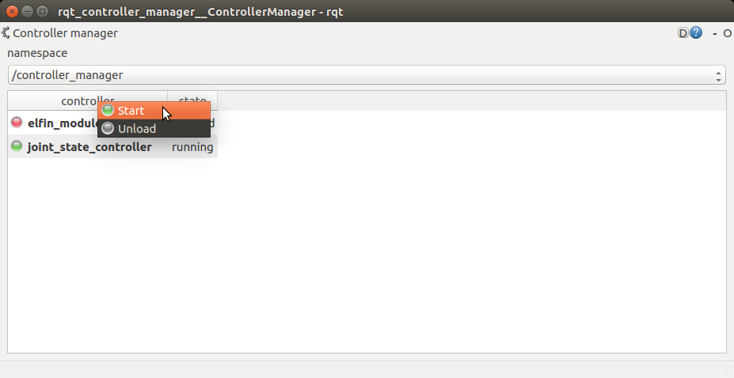
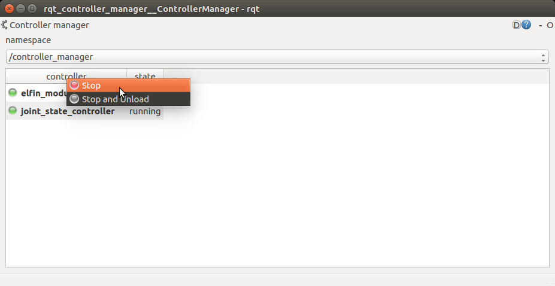

Elfin module tutorial
======

### Usage with Gazebo Simulation

Bring up the simulated module in Gazebo:
```sh
$ roslaunch elfin_gazebo elfin_module_empty_world.launch model:=module_xx # e.g. module_14
```
The module is controlled by "elfin_module_controller/follow_joint_trajectory" action. elfin_robot_bringup/script/elfin_module_cmd_pub.py is an example for that.
```sh
$ rosrun rosrun elfin_robot_bringup elfin_module_cmd_pub.py
```

---

### Usage with real module

Put the file *elfin_drivers.yaml*, that you got from the vendor, into the folder elfin_robot_bringup/config/.

Connect the module to the computer with a LAN cable. Then confirm the ethernet interface name of the connection with `ifconfig`. The default ethernet name is eth0. If the ethernet name is not eth0, you should correct the following line in the file *elfin_robot_bringup/config/elfin_drivers.yaml* 
```
elfin_ethernet_name: eth0
```

Load module model：
```sh
$ roslaunch elfin_robot_bringup elfin_module_bringup.launch model:=module_xx # e.g. module_14
```
Bring up the hardware. Before bringing up the hardware, you should setup Linux with PREEMPT_RT properly. There is a [tutorial](https://wiki.linuxfoundation.org/realtime/documentation/howto/applications/preemptrt_setup). There are two versions of elfin EtherCAT slaves. Please bring up the hardware accordingly.
```sh
$ sudo chrt 10 bash
$ roslaunch elfin_robot_bringup elfin_module_ros_control.launch 
```
or
```sh
$ sudo chrt 10 bash
$ roslaunch elfin_robot_bringup elfin_module_ros_control_v2.launch 
```
Get the status of the model with the following topics:  

* **elfin_ros_control/elfin/enable_state (std_msgs/Bool)**  
The servo status of the module.  
true: enabled / false: disabled

* **elfin_ros_control/elfin/fault_state (std_msgs/Bool)**  
The fault status of the module.  
true: warning / false: no fault

Clear fault:  
```sh
$ rosservice call /elfin_ros_control/elfin/clear_fault "data: true"
```

Enable servos:  
```sh
$ rosservice call /elfin_ros_control/elfin/enable_robot "data: true"
```

Start the controller:  
If you haven't installed rqt_controller_manager, please install it first
```sh
$ sudo apt-get install ros-<distro>-rqt-controller-manager
```
Using the short name of your ROS distribution instead of `<distro>`, for example: indigo, kinetic.

Start the controller with rqt_controller_manager
```sh
$ rosrun rqt_controller_manager rqt_controller_manager
```


Control the module:  
The module is controlled by "elfin_module_controller/follow_joint_trajectory" action. elfin_robot_bringup/script/elfin_module_cmd_pub.py is an example for that.
```sh
$ rosrun elfin_robot_bringup elfin_module_cmd_pub.py
```

disable servos:
```sh
$ rosservice call /elfin_ros_control/elfin/disable_robot "data: true"
```

Stop the controller:
```sh
$ rosrun rqt_controller_manager rqt_controller_manager
```
