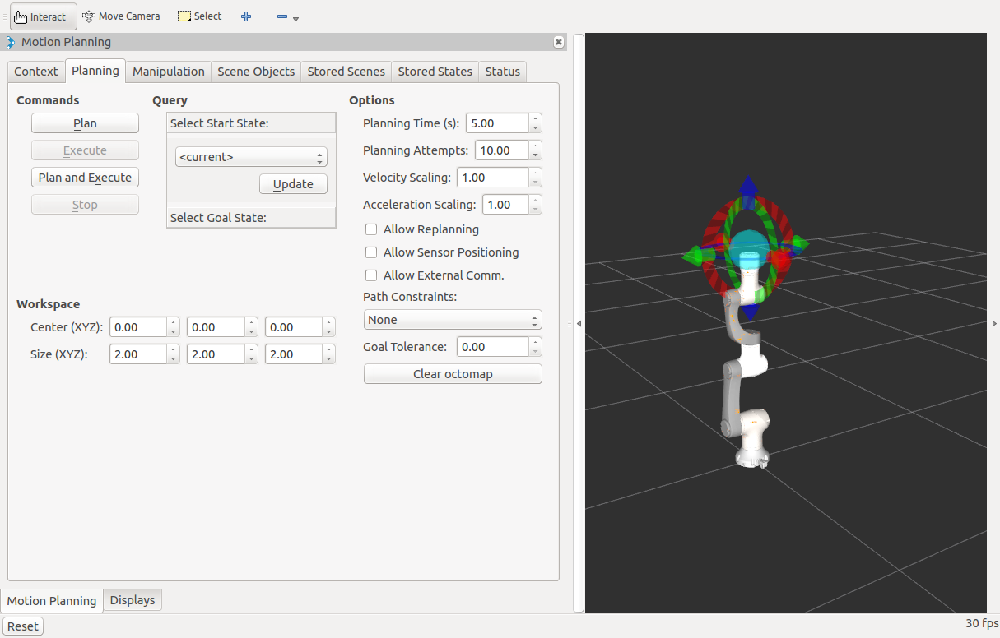
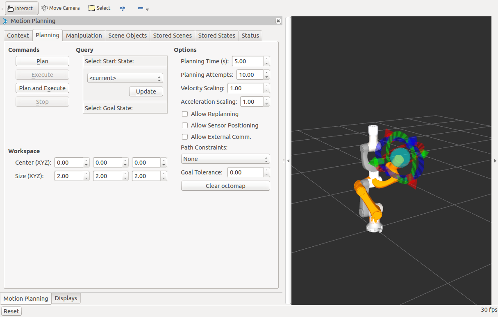
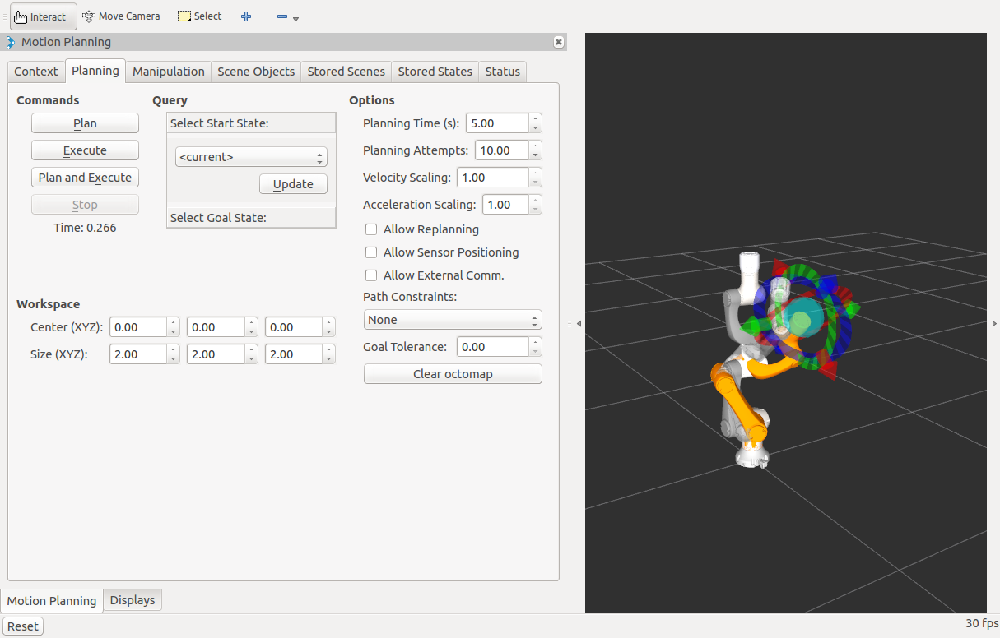
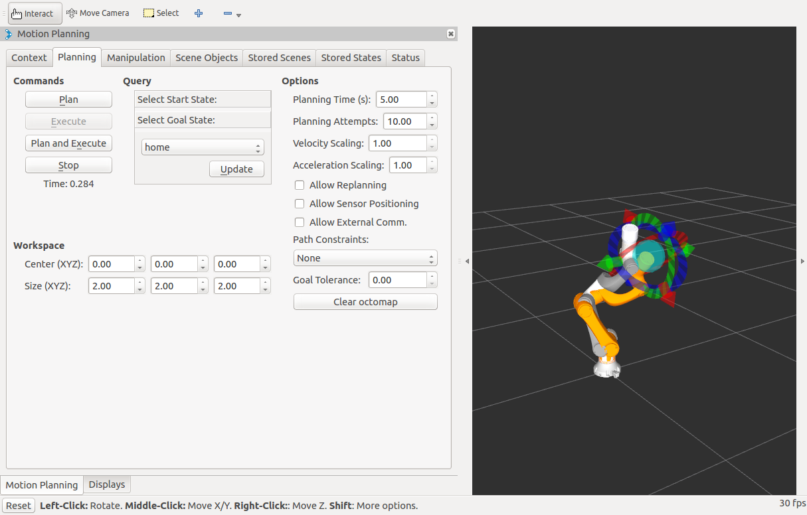

### MoveIt! RViz Plugin 使用说明

更多说明请见：  
http://docs.ros.org/indigo/api/moveit_tutorials/html/doc/ros_visualization/visualization_tutorial.html

#### 设置起始位置

进入"Motion Planning"界面下的Planning选项卡，在"Select Start State"项目下选择"current"，然后按下"Update"按钮。

#### 设置目标位置

拖动机械臂末端的标记，到任意一个目标位置。

#### 规划路径

设置好起始位置和目标位置后，等待约5s的时间，然后按下"Plan"按键。此时会显示出一条规划好的轨迹。

#### 实现路径

按下"Execute"按键，机械臂会沿着路径运动。在此过程中，可以按下"Stop"键来让机械臂停止。

